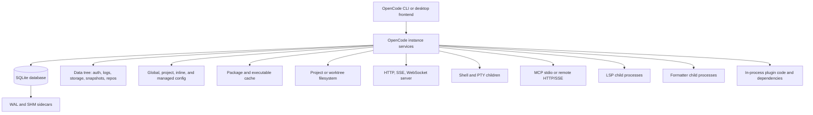
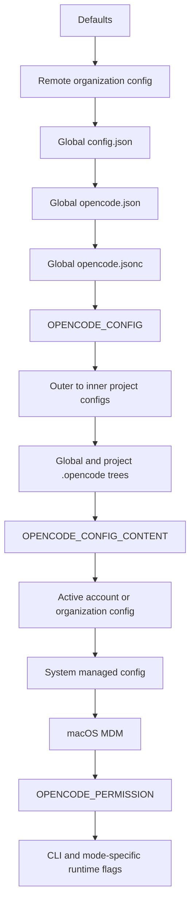
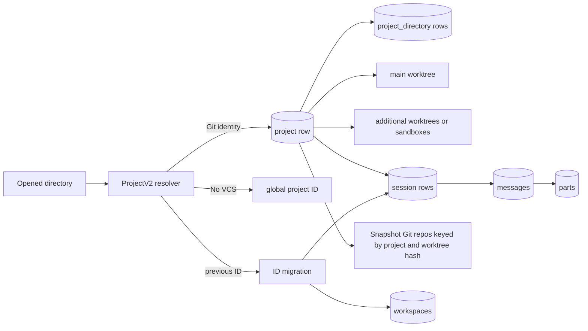
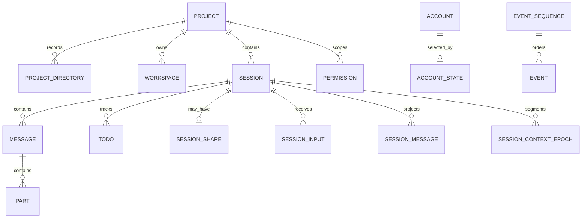
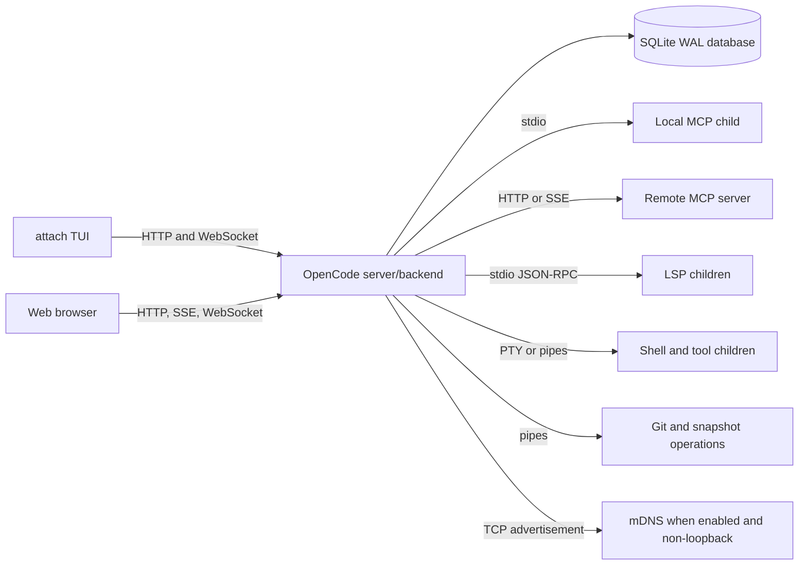
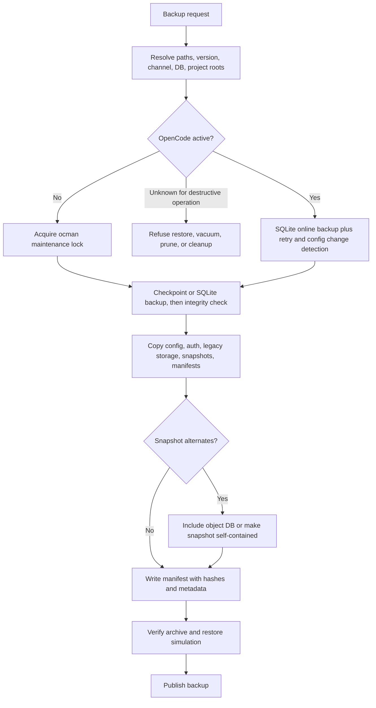

# OpenCode Filesystem, Configuration, Storage, and Runtime Artifacts Reference for ocman

- **Research execution:** 2026-07-13 13:19 America/New_York (EDT)
- **OpenCode stable baseline:** v1.17.18, commit [`b1fc8113948b518835c2a39ece49553cffe9b30c`](https://github.com/anomalyco/opencode/commit/b1fc8113948b518835c2a39ece49553cffe9b30c)
- **OpenCode development comparison:** commit [`049ee1ce5ebac703939b18493613abbbb2286158`](https://github.com/anomalyco/opencode/commit/049ee1ce5ebac703939b18493613abbbb2286158), inspected as the default-branch head on 2026-07-13
- **ocman baseline:** commit [`9d943886d58999076894eab3f42df9703870d7f9`](https://github.com/fariello/ocman/commit/9d943886d58999076894eab3f42df9703870d7f9)
- **Primary purpose:** implementation, backup, restoration, recovery, cleanup, migration, diagnostics, and cross-platform path discovery for `ocman`
- **Evidence labels:** **Documented**, **Source-verified**, **Empirically observed**, **Inferred**, and **Unverified or version-dependent**

> **Important limitation:** OpenCode was not installed in the research container, and outbound `git clone` access was unavailable. Stable and development source were therefore inspected through immutable GitHub commit URLs. Linux, macOS, Windows, WSL, desktop, and live concurrency behavior were not exercised with a running OpenCode binary. Claims below are source-derived unless explicitly labeled otherwise. No destructive operation was performed against a real OpenCode installation or repository.

## 1. Executive summary

OpenCode v1.17.18 uses a distributed on-disk model rather than one self-contained application directory. Its most important persistent state is an SQLite database under the XDG data directory, normally `~/.local/share/opencode/opencode.db` on Linux. The database is opened in WAL mode with `synchronous=NORMAL`, a 5-second busy timeout, foreign keys enabled, and a passive checkpoint at startup. Copying only `opencode.db` while OpenCode is active is unsafe. Sequentially copying the database, WAL, and SHM files while a writer remains active also cannot guarantee a point-in-time image. `ocman` should prefer SQLite’s online backup API, or require process quiescence and perform a verified checkpoint before a filesystem copy. [Source: `Database` service](https://github.com/anomalyco/opencode/blob/b1fc8113948b518835c2a39ece49553cffe9b30c/packages/core/src/database/database.ts)

OpenCode configuration is also not a first-file-wins lookup. It is a layered merge involving remote organization configuration, several global filenames, `OPENCODE_CONFIG`, upward project configuration, global and project `.opencode` trees, inline JSON, account or organization data, managed configuration, macOS managed preferences, and late permission overrides. Most objects deep-merge, scalar values are replaced by later sources, `instructions` are concatenated and deduplicated, and plugin lists receive special origin-aware deduplication. `ocman` currently searches a short list and returns the first matching file, which does not reproduce OpenCode’s effective configuration. [Source: `Config` loader](https://github.com/anomalyco/opencode/blob/b1fc8113948b518835c2a39ece49553cffe9b30c/packages/opencode/src/config/config.ts), [path discovery](https://github.com/anomalyco/opencode/blob/b1fc8113948b518835c2a39ece49553cffe9b30c/packages/opencode/src/config/paths.ts)

OpenCode creates snapshots in a hidden Git repository rooted at `${data}/snapshot/<project-id>/<hash(worktree)>`. Those repositories can use Git object alternates that point to the original repository’s object database. A snapshot directory copied by itself may therefore be incomplete after relocation. A correct backup policy must either include and restore the source object database at the expected location, or make each snapshot repository self-contained before archiving it. [Source: snapshot implementation](https://github.com/anomalyco/opencode/blob/b1fc8113948b518835c2a39ece49553cffe9b30c/packages/opencode/src/snapshot/index.ts)

OpenCode’s data directory can also hold `auth.json`, logs, legacy JSON storage, session-diff sidecars, snapshot repositories, repository-related state, channel-specific databases, and extension state. Its cache directory contains downloaded package dependencies and executable caches. Its configuration trees may contain user-authored agents, commands, modes, plugins, skills, tools, themes, package manifests, lockfiles, and `node_modules`. Managed configuration can reside in `/etc/opencode`, `/Library/Application Support/opencode`, or `%ProgramData%\opencode`. Project-local instructions can also exist outside `.opencode`, including `AGENTS.md` and compatibility fallbacks such as `CLAUDE.md`. [Sources: `Global.Path`](https://github.com/anomalyco/opencode/blob/b1fc8113948b518835c2a39ece49553cffe9b30c/packages/core/src/global.ts), [configuration docs](https://opencode.ai/docs/config/), [rules docs](https://opencode.ai/docs/rules/)

The highest-priority `ocman` changes are:

1. Replace raw live database-family copying with a consistent SQLite backup method and refuse unsafe restore, vacuum, compaction, or cleanup while any OpenCode process may still hold the database.
2. Derive data, config, cache, state, temp, and managed paths from OpenCode-compatible path resolution rather than hard-coded Linux defaults.
3. Inventory and preserve every configuration layer with original path and precedence metadata instead of flattening same-named files into one ZIP namespace.
4. Treat `auth.json`, account and credential database rows, managed configuration, project permission rows, snapshots, legacy storage, and extension-owned content according to explicit backup classes.
5. Version every backup manifest with OpenCode version, database schema, path provenance, file identity, hashes, permissions, symlink metadata, and a restore plan.
6. Add schema-aware import and restore validation. Avoid unrestricted `INSERT OR REPLACE` with foreign keys disabled unless the bundle has been validated against an exact compatible schema.
7. Add a machine-readable artifact manifest command so future OpenCode layout drift is detectable rather than silently ignored.

## 2. Research scope, versions, and evidence

### Version record

| Item | Result | Evidence status |
|---|---|---|
| Research date and timezone | 2026-07-13 13:19 EDT | Empirically observed from the execution environment |
| Installed OpenCode | Not installed in the research container | Empirically observed using executable discovery |
| Latest stable OpenCode | v1.17.18, released 2026-07-09 | Documented by the [immutable release page](https://github.com/anomalyco/opencode/releases/tag/v1.17.18) |
| Stable commit examined | `b1fc8113948b518835c2a39ece49553cffe9b30c` | Source-verified |
| Development commit examined | `049ee1ce5ebac703939b18493613abbbb2286158` | Source-verified as default-branch head on 2026-07-13 |
| ocman commit examined | `9d943886d58999076894eab3f42df9703870d7f9` | Source-verified |
| ocman tagged baseline visible in source | v1.1.0 | Source-verified in [`ocman/cli.py`](https://github.com/fariello/ocman/blob/9d943886d58999076894eab3f42df9703870d7f9/ocman/cli.py) |
| Operating system actually available | Linux container, kernel reported as 4.4.0, Python 3.13.5 | Empirically observed |
| OpenCode runtime modes tested | None, because no OpenCode binary was present | Explicit limitation |
| macOS, Windows, WSL tested | No | Explicit limitation |

### Scope and method

The stable tag was treated as authoritative for behavior. Current development source was checked for imminent version drift, but no claim about unreleased behavior is promoted to stable behavior. The development head already contained release-version synchronization work beyond v1.17.18, so `ocman` must not infer behavior solely from a development version string.

The `ocman` repository was reviewed at its current commit, especially [`README.md`](https://github.com/fariello/ocman/blob/9d943886d58999076894eab3f42df9703870d7f9/README.md), [`CHANGELOG.md`](https://github.com/fariello/ocman/blob/9d943886d58999076894eab3f42df9703870d7f9/CHANGELOG.md), [`pyproject.toml`](https://github.com/fariello/ocman/blob/9d943886d58999076894eab3f42df9703870d7f9/pyproject.toml), and [`ocman/cli.py`](https://github.com/fariello/ocman/blob/9d943886d58999076894eab3f42df9703870d7f9/ocman/cli.py). The current commit reports 292 passing and two skipped tests in its commit description, but those tests were not rerun in this environment.

### Evidence hierarchy applied

1. Pinned OpenCode stable source.
2. Pinned OpenCode development source, labeled unreleased.
3. Official OpenCode documentation, accessed 2026-07-13.
4. Runtime observations, where possible.
5. OpenCode release notes and tests.
6. Issues and pull requests only as secondary context.

The report intentionally marks unresolved items rather than filling gaps with conventions from unrelated tools.

## 3. OpenCode architecture relevant to filesystem management

OpenCode has five principal storage and runtime planes:

1. **Global application paths**, resolved once and used for data, configuration, cache, state, logs, repository state, executable cache, and temp content.
2. **Relational state**, primarily the SQLite database and its WAL/SHM sidecars.
3. **Filesystem state**, including authentication JSON, legacy JSON storage, snapshot Git repositories, logs, generated configuration support files, and extension dependencies.
4. **Project state**, including repository identity, worktree and sandbox paths, project configuration, instruction files, and source-control-dependent snapshots.
5. **Runtime resources**, including HTTP listeners, WebSockets, mDNS, PTYs, child shells, Git, LSP processes, MCP transports, formatters, package installation, and plugins.



The path service creates several directories eagerly when imported: data, config, state, temp, log, bin, and repos. The `OPENCODE_CONFIG_DIR` override changes the effective config path, but does not relocate data, cache, state, logs, or temp. [Source: `Global`](https://github.com/anomalyco/opencode/blob/b1fc8113948b518835c2a39ece49553cffe9b30c/packages/core/src/global.ts)

OpenCode’s server is an in-process Node HTTP server. When configured with port `0`, it tries port 4096 first, then an operating-system-assigned free port. It can expose HTTP APIs and WebSockets and optionally publishes mDNS only when bound to a non-loopback hostname. Shutdown closes mDNS, WebSockets, and HTTP connections, with a one-second graceful shutdown timeout in the source examined. [Source: `Server.listen`](https://github.com/anomalyco/opencode/blob/b1fc8113948b518835c2a39ece49553cffe9b30c/packages/opencode/src/server/server.ts)

## 4. Master artifact inventory

The table uses path expressions because exact resolved locations depend on XDG environment variables, operating system behavior, channel, and explicit overrides.

| Artifact | Path expression | Linux | macOS | Windows | WSL | Read/write/delete | Creation trigger | Format/schema | Sensitive | Permissions | Locking/concurrency | Lifecycle | Precedence role | Backup class | Safe deletion | Version notes | Evidence |
|---|---|---|---|---|---|---|---|---|---|---|---|---|---|---|---|---|---|
| Data root | `${xdgData}/opencode` | Usually `~/.local/share/opencode` | XDG-derived, not empirically tested | Dependency-derived, unresolved here | Linux-side XDG | R/W, directory created | Module initialization | Directory | Mixed | Umask-derived | Shared by processes | Persistent | None | Must inventory | Only selective deletion stopped | Stable 1.17.18 | [`Global.Path.data`](https://github.com/anomalyco/opencode/blob/b1fc8113948b518835c2a39ece49553cffe9b30c/packages/core/src/global.ts) |
| Config root | `${xdgConfig}/opencode` or `OPENCODE_CONFIG_DIR` | Usually `~/.config/opencode` | XDG-derived | Dependency-derived | Linux-side XDG | R/W | Module initialization | Directory tree | Potential secrets | Umask-derived | Plugin/config flock for some writes | Persistent | Major config layer | Must back up user-authored content | No, except generated dependencies with care | Override affects config only | Same source |
| Cache root | `${xdgCache}/opencode` | Usually `~/.cache/opencode` | XDG-derived | Dependency-derived | Linux-side XDG | R/W/delete | Module initialization | Directory tree | Usually low, extensions may differ | Umask-derived | Package install flock | Regenerable with exceptions | None | Usually derived | Generally stopped or idle | Stable | Same source |
| State root | `${xdgState}/opencode` | Usually `~/.local/state/opencode` | XDG-derived | Dependency-derived | Linux-side XDG | R/W | Module initialization | State and flock files | Low to medium | Umask-derived | Global flock resources | Persistent/transient mix | None | Should inspect | Only when no process uses locks | Stable | Same source |
| Temp root | `${os.tmpdir()}/opencode` | Usually `/tmp/opencode` | OS temp | OS temp | Linux temp | R/W/delete | Module initialization | Temporary files | May contain sensitive staging | Temp semantics | Races possible | Transient | None | Exclude by default | Only after ownership/process checks | Stable | Same source |
| Executable cache | `${cache}/bin` | XDG cache | XDG cache | Dependency-derived | Linux-side | R/W/delete | Module initialization/download | Executables | Supply-chain sensitive | Executable bits | Concurrent use risk | Regenerable | None | Derived | Stop users first | Stable | Same source |
| Package cache | `${cache}/packages/<sanitized-package>` | XDG cache | XDG cache | Invalid filename chars sanitized | Linux-side | R/W/delete | Plugin, formatter, LSP dependency resolution | `package.json`, lock, `node_modules` | Extension-dependent | Umask-derived | File lock `npm-install:<dir>` | Regenerable, possibly extension-modified | None | Derived or unknown | Delete only if extension state excluded | Stable | [`Npm.Service`](https://github.com/anomalyco/opencode/blob/b1fc8113948b518835c2a39ece49553cffe9b30c/packages/core/src/npm.ts) |
| Log directory | `${data}/log` | Data root | XDG-derived | Dependency-derived | Linux-side | R/W/delete | Module initialization and runtime logging | Text/structured runtime logs, exact retention unresolved | Potentially sensitive | Umask-derived | Multiple writers possible | Persistent until pruned | None | Optional protected diagnostics | Delete when stopped; rotate carefully | Stable | [`Global.Path.log`](https://github.com/anomalyco/opencode/blob/b1fc8113948b518835c2a39ece49553cffe9b30c/packages/core/src/global.ts) |
| Repository state | `${data}/repos` | Data root | XDG-derived | Dependency-derived | Linux-side | R/W/delete | Module initialization/features | Feature-specific | Medium | Umask-derived | Unknown | Persistent/feature-specific | None | Inspect before deletion | Not generically safe | Stable | Same source |
| Main database | `${data}/opencode.db`, channel variant, `OPENCODE_DB` | Typical Linux path | XDG-derived | Dependency-derived | Linux-side | R/W/delete | Database initialization | SQLite | High | Umask-derived | SQLite WAL locks, 5s busy timeout | Authoritative | None | Must back up consistently | Never delete casually | Channel DB support in 1.17.18 | [`Database`](https://github.com/anomalyco/opencode/blob/b1fc8113948b518835c2a39ece49553cffe9b30c/packages/core/src/database/database.ts) |
| WAL sidecar | `<db>-wal` | Adjacent | Adjacent | Adjacent | Adjacent | R/W/delete by SQLite | First WAL write | SQLite WAL | High | Inherits directory | Critical live concurrency | Ephemeral but may persist | None | Part of live DB family | Unsafe to delete active | WAL mode | Same source |
| SHM sidecar | `<db>-shm` | Adjacent | Adjacent | Adjacent | Adjacent | R/W/delete by SQLite | WAL shared memory use | SQLite shared memory | Medium | Inherits directory | Critical live concurrency | Ephemeral | None | Exclude only from online backup output, not raw live copy | Unsafe to delete active | WAL mode | Same source |
| Rollback journal/temp DB files | Adjacent or OS temp, SQLite-controlled | Possible | Possible | Possible | Possible | R/W/delete | Transactions/temp operations | SQLite internal | High | SQLite-controlled | Critical | Transient | None | Exclude after clean shutdown | Unsafe active | Version/operation-dependent | SQLite behavior plus DB source |
| Authentication file | `${data}/auth.json` | Typical Linux path | XDG-derived | Dependency-derived | Linux-side | R/W/delete | Login/logout or imported auth | JSON union of OAuth/API/well-known entries | Critical | Explicit `0600` write request | Whole-file replacement; cross-process race possible | Persistent | Auth source | Protected secret backup | Delete only to log out, stopped preferred | `OPENCODE_AUTH_CONTENT` bypasses file | [`Auth`](https://github.com/anomalyco/opencode/blob/b1fc8113948b518835c2a39ece49553cffe9b30c/packages/opencode/src/auth/index.ts) |
| Legacy JSON storage root | `${data}/storage` | Data root | XDG-derived | Dependency-derived | Linux-side | R/W/delete | Legacy operation/migration | Hierarchical JSON | High, contains prompts/content | Umask-derived | In-process lock only in inspected implementation | Legacy and sidecar state | None | Back up when present | Delete only after verified migration and user approval | Migrations 1 and 2 visible | [`Storage`](https://github.com/anomalyco/opencode/blob/b1fc8113948b518835c2a39ece49553cffe9b30c/packages/opencode/src/storage/storage.ts) |
| Storage migration marker | `${data}/storage/migration` | Same | Same | Same | Same | R/W | Migration | Marker/version | Low | Umask-derived | In-process | Persistent marker | None | Include with legacy storage | Not independently | Legacy | Same source |
| Session diff files | `${data}/storage/session_diff/<session>.json` | Same | Same | Same | Same | R/W/delete | Legacy migration and summary diff extraction | JSON | Sensitive | Umask-derived | In-process lock | Persistent sidecar | None | Include if present | Only with verified semantics | Migration 2 | Same source |
| Snapshot root | `${data}/snapshot/<project-id>/<hash(worktree)>` | Data root | XDG-derived | Dependency-derived | Linux-side | R/W/delete | Snapshot-enabled Git session | Hidden Git repository | Sensitive source history | Umask/Git-derived | In-process semaphore, Git locks | Persistent with periodic GC | None | Back up with object dependencies | Delete loses undo/history | Alternates may reference source repo | [`Snapshot`](https://github.com/anomalyco/opencode/blob/b1fc8113948b518835c2a39ece49553cffe9b30c/packages/opencode/src/snapshot/index.ts) |
| Global server config | `${config}/config.json`, `opencode.json`, `opencode.jsonc` | `~/.config/opencode/...` usually | XDG-derived | Dependency-derived | Linux-side | R/W | User or migration/default creation | JSON/JSONC | May contain provider/MCP secrets | Umask-derived | Some writes flocked | Persistent | Merged in defined order | Must back up | User-controlled, do not delete | Legacy `config` may migrate | [`Config`](https://github.com/anomalyco/opencode/blob/b1fc8113948b518835c2a39ece49553cffe9b30c/packages/opencode/src/config/config.ts) |
| TUI config | `${config}/tui.json` and related candidates | Typical | XDG-derived | Dependency-derived | Linux-side | R/W | User/TUI | JSON/JSONC | Low to medium | Umask-derived | Unknown | Persistent | Separate TUI config plane | Back up | User-controlled | `OPENCODE_TUI_CONFIG` supported | [Official config docs](https://opencode.ai/docs/config/) |
| Project config | Upward `opencode.jsonc` and `opencode.json` | Project paths | Project paths | Project paths | Project paths | R/W by user, read by OpenCode | Discovery on startup | JSON/JSONC | Potential secrets | Repository semantics | Multiple instances read | Persistent | Merged outer to inner | Back up if not in VCS | User-controlled | Disabled by flag | [`ConfigPaths`](https://github.com/anomalyco/opencode/blob/b1fc8113948b518835c2a39ece49553cffe9b30c/packages/opencode/src/config/paths.ts) |
| `.opencode` tree | Global, upward project dirs, home `.opencode`, custom config dir | Multiple | Multiple | Multiple | Multiple | R/W | Discovery/install | Agents, commands, modes, plugins, skills, tools, themes, package files | Mixed | Repository/umask | Dependency install locks | Persistent | Additive customizations | Back up user-authored files | Generated deps may be removed | Singular aliases supported | Same source and [docs](https://opencode.ai/docs/config/) |
| Generated config-tree support | `.gitignore`, `package.json`, `package-lock.json`, `node_modules` | Under config dirs | Same | Same | Same | R/W/delete | Config initialization/dependency install | npm artifacts | Supply-chain metadata | Umask-derived | npm/install locks | Derived except user edits | None | Manifest optional, node_modules derived | Delete node_modules when stopped | `ignoreScripts: true` in npm service | [`Config`](https://github.com/anomalyco/opencode/blob/b1fc8113948b518835c2a39ece49553cffe9b30c/packages/opencode/src/config/config.ts), [`Npm`](https://github.com/anomalyco/opencode/blob/b1fc8113948b518835c2a39ece49553cffe9b30c/packages/core/src/npm.ts) |
| Managed config | OS-specific managed root | `/etc/opencode` | `/Library/Application Support/opencode` | `%ProgramData%\opencode` | Linux side `/etc/opencode` | Usually read; administrative write | Administrator/MDM | JSON/JSONC/tree | Potentially sensitive | System ACLs | Shared system-wide | Persistent | High precedence | Must record, usually not user-backup by default | Do not delete through user tool | Stable source | [`managed.ts`](https://github.com/anomalyco/opencode/blob/b1fc8113948b518835c2a39ece49553cffe9b30c/packages/opencode/src/config/managed.ts) |
| macOS managed preferences | `/Library/Managed Preferences/.../ai.opencode.managed.plist` | N/A | User then system preference file | N/A | N/A | Read | MDM | plist converted through `plutil` | Potentially sensitive | System-managed | OS-managed | Persistent | Highest managed layer before permission env | Record provenance, not copy by default | Never user-delete | macOS only | Same source |
| Instructions | Project/global `AGENTS.md`, compatibility `CLAUDE.md`, configured files/globs/URLs | Project and config | Same | Same | Same | Read, `/init` may create/update `AGENTS.md` | Startup or `/init` | Markdown | May contain internal instructions | Repository/umask | Concurrent edits possible | Persistent | Prompt instruction layer | Back up if untracked | User-controlled | Compatibility fallback | [Rules docs](https://opencode.ai/docs/rules/) |
| LSP children | No fixed artifact; processes and possible cache packages | Runtime | Runtime | Runtime | Runtime | Spawn/terminate | Matching file access | stdio protocol | Can see source | Process permissions | Per-client lifecycle | Transient | None | No process backup | Stop before maintenance | Custom commands inherit env | [`LSP`](https://github.com/anomalyco/opencode/blob/b1fc8113948b518835c2a39ece49553cffe9b30c/packages/opencode/src/lsp/lsp.ts) |
| MCP auth/config | Config plus MCP-specific auth storage | Mixed, exact token path partly unresolved | Mixed | Mixed | Mixed | R/W | MCP setup/OAuth | JSON/database/config, implementation-dependent | Critical | Varies | Remote and child process concurrency | Persistent and runtime | Config layer | Secret backup only when fully identified | No generic deletion | Needs additional runtime validation | [`MCP`](https://github.com/anomalyco/opencode/blob/b1fc8113948b518835c2a39ece49553cffe9b30c/packages/opencode/src/mcp/index.ts) |
| HTTP listener | No required discovery file found | TCP | TCP | TCP | TCP | Runtime | `serve`, `web`, TUI/backend modes | HTTP, SSE, WebSocket | High exposure potential | Process identity | Port collision fallback | Transient | CLI flags | Not backed up | Ends with process | Port 0 prefers 4096 | [`Server`](https://github.com/anomalyco/opencode/blob/b1fc8113948b518835c2a39ece49553cffe9b30c/packages/opencode/src/server/server.ts) |

## 5. OS path-resolution matrix

OpenCode stable source imports `xdgData`, `xdgCache`, `xdgConfig`, and `xdgState` from `xdg-basedir`, then appends `opencode`. It uses `os.tmpdir()` for temp and `os.homedir()` for home, with `OPENCODE_TEST_HOME` as a test override. [Source](https://github.com/anomalyco/opencode/blob/b1fc8113948b518835c2a39ece49553cffe9b30c/packages/core/src/global.ts)

| Path class | Linux | macOS | Windows | WSL | Confidence and notes |
|---|---|---|---|---|---|
| Home | `os.homedir()` | `os.homedir()` | `os.homedir()` | WSL Linux home for Linux binary | Source-verified expression; resolved values environment-specific |
| Data | `${xdgData}/opencode`, normally `~/.local/share/opencode` | XDG library result, commonly XDG-style rather than `~/Library`, not tested | XDG library result, not established by this research | Linux XDG path inside WSL | Linux high confidence; macOS/Windows require empirical confirmation against bundled dependency version |
| Config | `${xdgConfig}/opencode`, normally `~/.config/opencode`; `OPENCODE_CONFIG_DIR` may replace | XDG-derived | XDG-derived | Linux XDG | Source-verified expression |
| Cache | `${xdgCache}/opencode`, normally `~/.cache/opencode` | XDG-derived | XDG-derived | Linux XDG | Source-verified expression |
| State | `${xdgState}/opencode`, normally `~/.local/state/opencode` | XDG-derived | XDG-derived | Linux XDG | Source-verified expression |
| Temp | `${os.tmpdir()}/opencode` | OS temp | OS temp | WSL Linux temp | Source-verified |
| Managed config | `/etc/opencode` | `/Library/Application Support/opencode` | `%ProgramData%\opencode` | `/etc/opencode` for Linux binary | Source-verified |
| macOS MDM | N/A | `/Library/Managed Preferences/<user>/ai.opencode.managed.plist`, then system equivalent | N/A | N/A | Source-verified |
| Project config | Filesystem upward search to worktree | Same semantics | Same semantics, path rules subject to Node and Git | Linux path semantics for Linux binary | Source-verified search algorithm, OS edge cases untested |

### Empty, relative, or invalid XDG variables

The OpenCode source assumes the imported XDG roots are usable and applies `path.join`. Exact handling of empty, relative, or malformed XDG variables is inherited from the bundled `xdg-basedir` version and was not empirically tested. `ocman` should not independently normalize these variables based on intuition. It should either use the same library behavior, ask OpenCode to report effective paths, or implement a compatibility module backed by versioned tests.

### WSL distinction

A Linux OpenCode binary inside WSL and a Windows OpenCode binary launched from Windows are separate installations unless explicitly configured otherwise. They can resolve different home, data, config, cache, state, temp, Git executable, and credential locations even when both operate on the same repository under `/mnt/c/...` or `\\wsl$\...`. `ocman` must identify the runtime family rather than grouping solely by repository path. Mixed access to a SQLite database across Windows and WSL filesystem boundaries should be treated as unsupported until tested, particularly on `/mnt/<drive>`, SMB-like `\\wsl$` access, or network filesystems.

## 6. Configuration discovery, precedence, and merge semantics

### Configuration precedence table

Later rows have higher precedence unless noted. TUI configuration is a related but separate plane.

| Priority | Source | Search rule | Multiple files? | Merge behavior | Can be overridden by | Invalid-file behavior | Persisted? | Evidence |
|---:|---|---|---|---|---|---|---|---|
| 0 | Compiled defaults | Built into schema/services | N/A | Base values | Everything later | N/A | No | [`Config`](https://github.com/anomalyco/opencode/blob/b1fc8113948b518835c2a39ece49553cffe9b30c/packages/opencode/src/config/config.ts) |
| 1 | Remote organization `.well-known/opencode` | Loaded for authenticated providers with well-known support | Potentially multiple providers | Deep merge in load order | All later layers | Remote errors are handled by provider-specific logic | Usually not persisted as a normal config file; caching not established | Same source |
| 2 | Global `config.json` | `${config}/config.json` | Yes, with other global candidates | Deep merge | Later global files and all later layers | Loader catches global failure and may continue with defaults/error reporting | Yes | Same source |
| 3 | Global `opencode.json` | `${config}/opencode.json` | Yes | Deep merge | `opencode.jsonc` and later layers | Same | Yes | Same source |
| 4 | Global `opencode.jsonc` | `${config}/opencode.jsonc` | Yes | Deep merge | Later layers | Same | Yes; created with schema when no config source exists | Same source |
| 5 | `OPENCODE_CONFIG` | Explicit file path | One explicit file | Deep merge | Project, directory, inline, organization, managed, permission layers | Explicit file parsing failure is expected to be fatal or surfaced | Existing file, not copied | Same source |
| 6 | Project config files | Walk from current directory upward to worktree; outer files merged before inner files | Yes | Deep merge | Later inner files and all later layers | Project load uses stricter error propagation | Existing files | [`ConfigPaths.project`](https://github.com/anomalyco/opencode/blob/b1fc8113948b518835c2a39ece49553cffe9b30c/packages/opencode/src/config/paths.ts) |
| 7 | Config directories and `.opencode` trees | Global config dir, upward project `.opencode`, home `.opencode`, custom config dir, deduplicated | Yes | Config files merge; agents/commands/modes/plugins are additive or keyed | Later directory sources and higher layers | Malformed customization may fail startup or skip item depending loader | Files persist; dependencies may be generated | Same source and [`Config`](https://github.com/anomalyco/opencode/blob/b1fc8113948b518835c2a39ece49553cffe9b30c/packages/opencode/src/config/config.ts) |
| 8 | `OPENCODE_CONFIG_CONTENT` | Inline JSON/JSONC content | One value | Deep merge | Organization account, managed, MDM, permission env | Parse failure surfaced | No | Same source |
| 9 | Active account or organization console configuration | Loaded from account context | Potentially one active organization layer | Deep merge | Managed, MDM, permission env | Service-dependent | May be represented in DB/account service | Same source; omitted from simplified public precedence list |
| 10 | System managed config | `/etc/opencode`, macOS Application Support, or `%ProgramData%\opencode` | Directory/config candidates | Deep merge | macOS MDM and late permission env | Administrative configuration errors should surface | Yes | [`managed.ts`](https://github.com/anomalyco/opencode/blob/b1fc8113948b518835c2a39ece49553cffe9b30c/packages/opencode/src/config/managed.ts) |
| 11 | macOS MDM preferences | User managed preference, then system | Up to two | Later managed preference values win | Late permission env where applicable | `plutil`/plist errors surfaced or skipped by source path | OS-managed | Same source |
| 12 | `OPENCODE_PERMISSION` | Inline permission JSON | One value | Merged into permission object late | Runtime CLI constraints only | Parse error surfaced | No | [`Config`](https://github.com/anomalyco/opencode/blob/b1fc8113948b518835c2a39ece49553cffe9b30c/packages/opencode/src/config/config.ts) |
| 13 | CLI flags and command-mode arguments | Current invocation | Multiple flags | Runtime override, not always part of config object | Nothing for that invocation | CLI validation | No | [CLI docs](https://opencode.ai/docs/cli/) |

The public documentation presents the main sequence as remote, global, explicit, project, `.opencode`, inline, managed, and MDM. Source inspection adds important nuance: all three global names can merge, organization/account-derived config may be injected after inline content, and permission overrides are applied late. [Official docs](https://opencode.ai/docs/config/), [stable source](https://github.com/anomalyco/opencode/blob/b1fc8113948b518835c2a39ece49553cffe9b30c/packages/opencode/src/config/config.ts)

### Merge-semantics table

| Configuration field/type | Earlier value | Later value | Final value | Rule | Source evidence | Empirical confirmation |
|---|---|---|---|---|---|---|
| Scalar string/number | `model=A` | `model=B` | `model=B` | Later scalar replaces | `mergeDeep` use in [`Config`](https://github.com/anomalyco/opencode/blob/b1fc8113948b518835c2a39ece49553cffe9b30c/packages/opencode/src/config/config.ts) | Not run |
| Boolean | `snapshot=true` | `snapshot=false` | `false` | Explicit false is preserved and replaces | Same | Not run |
| Nested object | `{provider:{x:{a:1}}}` | `{provider:{x:{b:2}}}` | `{provider:{x:{a:1,b:2}}}` | Recursive object merge | Same | Not run |
| Keyed MCP definitions | `{mcp:{a:{...}}}` | `{mcp:{b:{...}}}` | Both keys | Object merge by identifier | Same | Not run |
| Same keyed MCP definition | `mcp.a.url=X` | `mcp.a.url=Y` | URL `Y`, unaffected nested keys retained | Recursive merge then scalar replacement | Same | Not run |
| Agents/commands | Earlier keyed entry | Later same identifier | Later fields merge/replace according loader | Identifier-keyed object behavior plus file loader | Same | Not run |
| Generic array | `[a,b]` | `[c]` | Usually `[c]` | Arrays are not generically appended | Same | Not run |
| `instructions` array | `[a,b]` | `[b,c]` | `[a,b,c]` | Concatenate and deduplicate | Explicit special case in same source | Not run |
| Plugin list | Earlier origins/specifiers | Later duplicate package/specifier | Origin-aware deduplicated winning set | Special plugin merge/dedupe logic | Same and [`plugin/install.ts`](https://github.com/anomalyco/opencode/blob/b1fc8113948b518835c2a39ece49553cffe9b30c/packages/opencode/src/plugin/install.ts) | Not run |
| Permission object | Earlier rules | Later rules | Recursive merged rules, later conflicts win | Deep merge; env applied late | `Config` source | Not run |
| `null` | Non-null earlier | Later `null` | `null` only if schema accepts it | Merge passes value, then schema validates | Inferred from parser/schema pipeline | Not run |
| Missing field | Earlier value | Field absent later | Earlier retained | Deep merge semantics | Source-verified | Not run |

### Worked examples

**Example 1, scalar and nested object:** global `opencode.json` sets `model: A` and `provider.x.timeout: 20`; project config sets `model: B` and `provider.x.baseURL: U`. The result is `model: B` with both `timeout: 20` and `baseURL: U`.

**Example 2, instructions:** global config provides `instructions: ["AGENTS.md", "policy.md"]`; inline content provides `["policy.md", "local.md"]`. The final ordered list is the concatenated, deduplicated sequence `AGENTS.md`, `policy.md`, `local.md`.

**Example 3, managed override:** project config enables a tool or permission, inline content changes unrelated provider settings, and `/etc/opencode/opencode.jsonc` disables that permission. The managed value wins. `ocman` must show both provenance and effective value, because preserving only the project file cannot reproduce the effective system policy.



## 7. Project, repository, and worktree discovery

The current project service delegates identity resolution to the core project resolver, persists a project row, persists one or more project-directory associations, tracks a main worktree and sandbox paths, and migrates session and workspace references when an old project ID resolves to a new ID. The service removes stale sandbox paths that no longer exist. For non-version-controlled directories it uses the global project identity and stores the active directory on the session. [Source: `Project.fromDirectory`](https://github.com/anomalyco/opencode/blob/b1fc8113948b518835c2a39ece49553cffe9b30c/packages/opencode/src/project/project.ts), [project tables](https://github.com/anomalyco/opencode/blob/b1fc8113948b518835c2a39ece49553cffe9b30c/packages/core/src/project/sql.ts)

Legacy JSON migration derived a Git project identity from the root commit obtained through `git rev-list --max-parents=0 --all`. Current project resolution can return both a new and previous identity and then migrates sessions and workspaces. This means `ocman` must not assume that project IDs are forever stable or are merely hashes of absolute paths. [Source: legacy storage migration](https://github.com/anomalyco/opencode/blob/b1fc8113948b518835c2a39ece49553cffe9b30c/packages/opencode/src/storage/storage.ts)



### Edge cases and `ocman` implications

- **Moved repository:** the stored worktree may become stale; the resolver may migrate identity or add a new directory association. `ocman` should compare canonical filesystem identity, Git common directory, and OpenCode project-directory records before declaring an orphan.
- **Clone or reinitialize:** the root commit or repository identity can differ, producing a different project. Do not merge solely by remote URL or directory basename.
- **Additional Git worktree:** the project can share identity while recording distinct directories and snapshot keys. Preserve the complete `project_directory` and sandbox set.
- **Nested repository/monorepo:** project configuration search stops at OpenCode’s resolved worktree boundary, but nested Git discovery may select a nearer repository. This requires runtime tests before `ocman` performs automatic consolidation.
- **Symlinked path:** source calls path-resolution helpers, but symlink canonicalization details were not empirically tested. Store both lexical and resolved paths in diagnostics.
- **Bare repository:** not tested. Treat project identity and worktree assumptions as unresolved.
- **Windows drive, UNC, and WSL paths:** current schema uses absolute-path codecs, but case folding, drive normalization, UNC identity, and cross-environment equivalence were not tested. Never compare raw path strings alone.

## 8. Project-local and global customization trees

Canonical customization directories documented by OpenCode are plural: `agents/`, `commands/`, `modes/`, `plugins/`, `skills/`, `tools/`, and `themes/`. Singular aliases are retained for compatibility. OpenCode loads customizations from the global config tree, upward project `.opencode` trees, a home `.opencode` tree, and `OPENCODE_CONFIG_DIR`, with path deduplication. [Sources: official configuration docs](https://opencode.ai/docs/config/), [`ConfigPaths`](https://github.com/anomalyco/opencode/blob/b1fc8113948b518835c2a39ece49553cffe9b30c/packages/opencode/src/config/paths.ts)

| Child | Canonical behavior | Backup significance | Notes |
|---|---|---|---|
| `agents/` | User-authored agent definitions loaded by identifier | Must back up if not in VCS | Singular alias supported; exact extensions/frontmatter depend on loader |
| `commands/` | User-authored slash/custom commands | Must back up if not in VCS | Duplicate identifiers resolved by load/precedence order |
| `modes/` | Legacy/compatibility mode definitions | Back up when present | Source still invokes a mode loader |
| `plugins/` | Local plugin modules | Must back up source, audit dependencies | Executes with OpenCode process privileges |
| `skills/` | Skill definitions | Must back up if user-authored | Compatibility sources may include `~/.claude/skills/` |
| `tools/` | Custom tool code | Must back up and treat as executable | Can create arbitrary files/processes |
| `themes/` | TUI theme definitions | Optional user-authored config | Some plugin packages export themes |
| `plans/` | Not established as a core-recognized stable directory in the inspected loader | Unknown/user-owned | Do not delete merely because OpenCode does not currently load it |
| `package.json` | Dependency manifest in config tree | Back up if user-edited; otherwise reconstructable | OpenCode may create/update for plugin support |
| `package-lock.json` | Dependency lock | Advisable for reproducibility | npm service uses lock comparison |
| `node_modules/` | Installed dependencies | Usually derived | Extensions may improperly store state here, so classify before deletion |
| `.gitignore` | Generated exclusions for package artifacts | Reconstructable | Source writes entries for package files and `node_modules` |
| `opencode.json/jsonc` | Local tree configuration | Must back up with provenance | May collide by basename across layers |
| `tui.json/jsonc` | TUI configuration | Must back up with provenance | Separate config plane |

OpenCode’s package installer uses npm Arborist with `ignoreScripts: true`, creates bin links, and uses file locks around installation. This reduces lifecycle-script risk but does not make package code safe: imported plugin code still executes in the OpenCode process. [Source: `Npm.Service`](https://github.com/anomalyco/opencode/blob/b1fc8113948b518835c2a39ece49553cffe9b30c/packages/core/src/npm.ts)

### Rules and compatible trees

OpenCode recognizes project `AGENTS.md` and a global `~/.config/opencode/AGENTS.md`. It can use `CLAUDE.md` and `~/.claude/CLAUDE.md` as fallbacks when corresponding `AGENTS.md` files are absent, and can discover compatible skill locations. `/init` creates or updates `AGENTS.md`, which is intended to be committed. Configured instruction files, globs, and remote URLs add further sources. Fallback behavior must not be confused with additive behavior. [Official rules documentation](https://opencode.ai/docs/rules/)

The user’s `.agents/` convention is not the same as OpenCode’s `.opencode/` tree. `ocman` should treat `.agents/` as user/project content unless a separately verified OpenCode compatibility feature says otherwise.

## 9. Persistent application data

The primary persistent application state is relational. The generated stable schema includes tables for projects, project directories, workspaces, sessions, messages, parts, todos, shares, event sequences, events, permissions, account state, accounts, control accounts, credentials, migration state, session context epochs, session inputs, and session messages. [Source: generated schema](https://github.com/anomalyco/opencode/blob/b1fc8113948b518835c2a39ece49553cffe9b30c/packages/core/src/database/schema.sql.ts)



The relational tree is complemented by filesystem state: `auth.json`, legacy JSON records, session-diff files, snapshot Git repositories, logs, configuration trees, and caches. The database does not make those files redundant.

### Authority classification

- **Authoritative:** SQLite project/session/message/part/todo/share/account/credential rows; `auth.json` where used; user-authored configuration and customizations.
- **Authoritative for historical features:** snapshot Git repositories and required object dependencies; legacy storage where migration is incomplete or sidecars remain in use.
- **Derived:** logs, most package caches, executable caches, `node_modules`, generated `.gitignore`, model/provider catalogs that can be refetched.
- **Mixed:** repository state, extension directories, config `package.json` and lockfiles, remote-configuration cache if any, MCP auth state.
- **Transient:** temp files, live sockets, PTYs, WAL shared memory after a clean database close, active locks.

### Sensitive-data classes

1. **Critical secrets:** `auth.json`, account access and refresh tokens, control-account tokens, credential values, provider or MCP client secrets.
2. **Confidential content:** prompts, messages, parts, tool results, diffs, todo content, snapshots, exported sessions, logs.
3. **Internal metadata:** project names and paths, workspace data, model/provider metadata, permissions, organization configuration.
4. **Low sensitivity:** version markers and reconstructable caches, subject to supply-chain integrity.

`ocman` backups should be encrypted or placed in a protected destination when they include classes 1 or 2. A backup catalog must not print tokens, prompt bodies, or secret values.

## 10. SQLite database, sidecars, migrations, and concurrency

### Stable database opening behavior

The stable database service resolves the database as follows:

- Default stable path: `${Global.Path.data}/opencode.db`.
- Non-stable channels can use `opencode-<channel>.db` unless channel separation is disabled.
- `OPENCODE_DB=:memory:` selects an in-memory database.
- Absolute `OPENCODE_DB` paths are used directly.
- Relative `OPENCODE_DB` paths are resolved under the data root.

At startup it sets WAL journal mode, `synchronous=NORMAL`, `busy_timeout=5000`, a negative cache size corresponding to approximately 64 MiB, foreign keys on, and issues a passive WAL checkpoint. Migrations are then applied. [Source: `Database`](https://github.com/anomalyco/opencode/blob/b1fc8113948b518835c2a39ece49553cffe9b30c/packages/core/src/database/database.ts)

### Table relationship summary

| Parent | Child | Delete behavior established in schema |
|---|---|---|
| `project` | `workspace` | Cascade |
| `project` | `project_directory` | Cascade |
| `project` | `permission` | Cascade |
| `project` | `session` | Cascade |
| `session` | `message` | Cascade |
| `message` | `part` | Cascade |
| `session` | `todo` | Cascade |
| `session` | `session_share` | Cascade |
| `session` | `session_context_epoch` | Cascade |
| `session` | `session_input` | Cascade |
| `session` | `session_message` | Cascade |
| `account` | `account_state.active_account_id` | Set null |
| `event_sequence` | `event` | Cascade through aggregate relationship |

The `session.parent_id` relationship is not represented as a cascading foreign key in the inspected generated schema. Deleting a parent session therefore must not be assumed to delete descendants automatically. `ocman`’s recursive behavior must query and validate the hierarchy itself. [Source: generated schema](https://github.com/anomalyco/opencode/blob/b1fc8113948b518835c2a39ece49553cffe9b30c/packages/core/src/database/schema.sql.ts)

### Backup safety

**Unsafe approach:** copy `opencode.db`, then `opencode.db-wal`, then `opencode.db-shm` while a writer continues. The three files can represent different instants. SHM is coordination state, not a durable backup artifact, and copying it does not freeze the WAL.

**Preferred approach:** open a read connection to the same database and use SQLite’s online backup API into a new destination database, with retries respecting the busy timeout. Then run `PRAGMA integrity_check` or at least `quick_check` on the destination and record schema/migration metadata.

**Alternative stopped approach:** verify all OpenCode processes using the database are stopped, acquire an `ocman` maintenance lock, checkpoint with `TRUNCATE` or another deliberate mode, close all handles, copy the main database, hash it, and verify integrity. Do not issue an aggressive checkpoint against an unknown active writer.

**Restore policy:** require OpenCode to be stopped, preserve the existing family in a rollback archive, atomically replace the main database within the same filesystem, remove stale WAL/SHM only after confirming no process is active, then open read-only for integrity and schema checks before allowing OpenCode to start.

### Vacuum and compaction

A vacuum rewrites the database and requires exclusive or substantial locking. `ocman` must refuse it when active-use detection is uncertain. `VACUUM INTO` can produce a compact copy, but it is a database export operation, not a generic replacement for preserving every runtime artifact.

### Import risks in current ocman

Current `ocman` code temporarily disables foreign keys and uses dynamic `INSERT OR REPLACE` behavior during bundle import. This can bypass integrity assumptions, overwrite unrelated rows, and behave differently when schemas drift. Imports should instead:

1. validate an explicit bundle schema and OpenCode schema fingerprint;
2. stage into a temporary database;
3. use allowlisted tables and columns;
4. detect identifier conflicts;
5. apply inserts in dependency order inside one transaction;
6. run `foreign_key_check` and `integrity_check` before commit or replacement.

[Source: current [`ocman/cli.py`](https://github.com/fariello/ocman/blob/9d943886d58999076894eab3f42df9703870d7f9/ocman/cli.py)]

## 11. Legacy storage and migration layouts

The legacy storage service uses `${data}/storage` and maps keys to nested JSON files. It has a migration marker and two visible migrations:

1. **Migration 1:** moves from an older per-project hierarchy under `${data}/project/<projectDir>/storage/...` into a global storage hierarchy. It reconstructs projects, sessions, messages, and parts, and derives a Git project ID from a root commit when possible.
2. **Migration 2:** extracts session summary diff data into `${data}/storage/session_diff/<session>.json` and rewrites the summary aggregate.

The service uses an in-process reentrant lock, not a cross-process filesystem lock, around its own read/update operations. A maintenance utility must therefore assume that another OpenCode process can modify legacy files concurrently. [Source: `Storage`](https://github.com/anomalyco/opencode/blob/b1fc8113948b518835c2a39ece49553cffe9b30c/packages/opencode/src/storage/storage.ts)

### Migration handling policy for ocman

- Detect the migration marker and enumerate actual content rather than assuming presence or absence from version alone.
- Never delete old JSON merely because a SQLite database exists.
- Preserve unknown files and unknown migration versions.
- Compare record counts and identifiers before claiming a migration is complete.
- Record whether files are active, abandoned, or unclassified.
- Make cleanup opt-in and reversible.
- Treat a partially written JSON file, missing marker, or mixed hierarchy as recovery work, not an orphan-cleanup opportunity.

Historical global config file `config` may also be migrated to `config.json`, with provider/model transformations and removal of the legacy file. Backups taken before starting a new OpenCode version should include both the pre-migration file and resulting configuration until validation is complete. [Source: `Config`](https://github.com/anomalyco/opencode/blob/b1fc8113948b518835c2a39ece49553cffe9b30c/packages/opencode/src/config/config.ts)

## 12. Sessions, projects, messages, parts, todos, and shares

The relational hierarchy is project to session to message to part, with session-level todo, share, context-epoch, input, and session-message tables. Parts also carry session identifiers for query efficiency, but their declared cascading parent is the message. Project deletion cascades through sessions and most descendants. [Source: generated schema](https://github.com/anomalyco/opencode/blob/b1fc8113948b518835c2a39ece49553cffe9b30c/packages/core/src/database/schema.sql.ts)

### Export completeness requirements

A session export intended for full restoration should include:

- the session row;
- parent/child relationship metadata;
- every message row in deterministic order;
- every part row and any external file references it contains;
- todo rows;
- share metadata, with explicit privacy warning;
- context epochs, inputs, and session-message rows;
- project identity and directory provenance;
- referenced model/provider metadata needed to interpret content;
- session-diff sidecars when present;
- snapshot references or a statement that undo history is excluded;
- schema fingerprint and source OpenCode version.

A project export should additionally include project, project-directory, workspace, and project permission rows. Current `ocman` table lists appear to omit `permission` from project-scoped exports even though the table cascades from `project`. That omission can change restored authorization behavior. [Source: current `ocman/cli.py`](https://github.com/fariello/ocman/blob/9d943886d58999076894eab3f42df9703870d7f9/ocman/cli.py), [schema](https://github.com/anomalyco/opencode/blob/b1fc8113948b518835c2a39ece49553cffe9b30c/packages/core/src/database/schema.sql.ts)

### Event data

The event/event-sequence model is aggregate-based and may contain more than session events. An export implementation should not assume every `event.aggregate_id` is a session ID without inspecting event type and aggregate semantics. This is a material area for additional source tracing and tests.

## 13. Snapshots, patches, undo, redo, and revert storage

OpenCode creates a hidden Git repository for snapshot-enabled Git projects at:

```text
${Global.Path.data}/snapshot/<project.id>/<Hash.fast(worktree)>
```

It configures long paths, disables symlinks/autocrlf/fsmonitor in the snapshot repository, can copy the source index, and can write an `objects/info/alternates` file pointing to the source repository’s object store. It excludes certain large untracked files, with a 2 MiB threshold visible in source. It periodically runs Git garbage collection with a seven-day prune horizon. Cleanup is scheduled after startup and then hourly. [Source: `Snapshot`](https://github.com/anomalyco/opencode/blob/b1fc8113948b518835c2a39ece49553cffe9b30c/packages/opencode/src/snapshot/index.ts)

### Backup consequence of alternates

A copied snapshot repository can be structurally valid yet unusable because objects are borrowed from the original repository. Before backup, `ocman` should inspect:

```text
objects/info/alternates
```

If present, it should choose one of these explicit policies:

1. include the referenced source object database and restore it at a compatible path;
2. repack or otherwise copy borrowed objects into the snapshot repository, then remove the alternate only after verification;
3. exclude snapshots and clearly state that undo/redo history is not preserved.

Never silently package the snapshot directory and claim full restoration.

### Concurrency

The source uses an in-process semaphore keyed by snapshot Git directory. That does not coordinate a separate `ocman` process. Git itself uses lockfiles for certain operations, but `ocman` must not rely on incidental lock coverage. Snapshot backup, pruning, repacking, or deletion should occur only after OpenCode is stopped or through a future coordinated API.

## 14. Authentication and sensitive data

The stable auth service reads `OPENCODE_AUTH_CONTENT` before the file and otherwise uses `${data}/auth.json`. It writes the file with requested mode `0600`. The schema supports OAuth, API, and well-known authentication records. Logout or credential removal rewrites the file. [Source: `Auth`](https://github.com/anomalyco/opencode/blob/b1fc8113948b518835c2a39ece49553cffe9b30c/packages/opencode/src/auth/index.ts), [provider docs](https://opencode.ai/docs/providers/)

The database schema also contains sensitive columns:

- account access tokens;
- account refresh tokens;
- control-account tokens;
- generic credential values;
- active-account state.

[Source: generated schema](https://github.com/anomalyco/opencode/blob/b1fc8113948b518835c2a39ece49553cffe9b30c/packages/core/src/database/schema.sql.ts)

### Security requirements for ocman

- Exclude secrets by default from ordinary diagnostics and support bundles.
- Offer a separate protected full-backup mode.
- Require restrictive destination permissions before writing secret-bearing archives.
- Preserve `0600` semantics on Unix restoration.
- On Windows, set an ACL for the restoring user rather than pretending a POSIX mode is sufficient.
- Never display token values in manifests, logs, diffs, or error messages.
- Encrypt backups at rest or integrate with an external encrypted destination.
- Detect environment-only auth and explain that it is not persisted or recoverable from the filesystem.
- Do not claim OS keychain protection. No keychain use was established in the inspected auth implementation.

## 15. Caches and downloaded dependencies

The core npm service stores per-package installations at `${cache}/packages/<sanitized-package>`. On Windows it replaces characters illegal in filenames and control characters. It uses npm Arborist, creates binary links, ignores lifecycle scripts during installation, and uses a file lock named from the installation directory. [Source: `Npm`](https://github.com/anomalyco/opencode/blob/b1fc8113948b518835c2a39ece49553cffe9b30c/packages/core/src/npm.ts)

Cache content can include:

- plugin packages and transitive dependencies;
- formatter packages such as Prettier or Biome when resolved through OpenCode’s package service;
- LSP packages and executables;
- executable downloads under `${cache}/bin`;
- model/provider catalogs and version markers, depending on feature;
- update payloads or installation staging, depending on installation method;
- extension-specific content.

### Deletion policy

Ordinary package and binary caches are usually regenerable, but deletion can cause network access, version drift, slower startup, or failure in offline environments. Extensions can also misuse a cache directory for user-authored state. `ocman cleanup` should therefore classify known core subtrees, report unknown children, stop active processes, and use a reversible quarantine before final deletion.

## 16. Logs, diagnostics, temp files, and atomic writes

OpenCode creates `${data}/log` and `${os.tmpdir()}/opencode` at global initialization. Exact log filename patterns, retention, rotation limits, and redaction behavior were not fully traced in this execution and must remain explicit unknowns. [Source: `Global.Path`](https://github.com/anomalyco/opencode/blob/b1fc8113948b518835c2a39ece49553cffe9b30c/packages/core/src/global.ts)

Logs and diagnostics can contain:

- absolute paths;
- provider/model identifiers;
- command lines and child-process failures;
- server request metadata;
- tool output;
- possibly fragments of prompts or remote errors.

They should be treated as confidential until redaction is proven.

### Temp and atomicity rules

- Temporary files must be created with exclusive creation and restrictive permissions.
- Ownership and file type must be checked before following or replacing a path.
- Atomic replacement must use a temp file in the same directory and filesystem as the target, followed by `fsync` of file and directory where durability matters.
- Cross-device rename must fall back to copy, fsync, metadata application, verification, and final replacement.
- Archive extraction must reject absolute paths, `..`, drive-qualified paths, UNC escapes, symlink escapes, hard-link escapes, device files, and duplicate normalized names.
- Stale temp files should be quarantined only after active-process checks and age/ownership validation.

Current `ocman` has a safe-extraction path check, which is a correct foundation, but restore should also validate symlink and hard-link entries and preserve provenance rather than flattening files. [Source: current `ocman/cli.py`](https://github.com/fariello/ocman/blob/9d943886d58999076894eab3f42df9703870d7f9/ocman/cli.py)

## 17. Processes, PTYs, child processes, and shutdown behavior

### Runtime-resource table

| Mode or feature | Process | Child executable | CWD | stdio/PTY | IPC/network | Files held open | Shutdown behavior | OS differences | Evidence |
|---|---|---|---|---|---|---|---|---|---|
| CLI/TUI | OpenCode Node/Bun process | Shells, Git, package tools as needed | Opened project directory | Terminal and PTY | May host internal HTTP backend | DB, logs, config, project files | Service finalizers, signal handling not exhaustively traced | PTY/signal semantics differ | [CLI docs](https://opencode.ai/docs/cli/) |
| `serve`/`web` | OpenCode server process | Browser launcher optionally | Selected directory | Standard process stdio | HTTP, SSE, WebSocket | DB, logs, listener | Graceful close, WebSocket/HTTP force-close path | Port binding/firewall differ | [`Server`](https://github.com/anomalyco/opencode/blob/b1fc8113948b518835c2a39ece49553cffe9b30c/packages/opencode/src/server/server.ts) |
| `attach` | Client TUI process | None required | Client directory/context | Terminal | HTTP/WebSocket to backend URL | Client config/logs | Ends independently of backend | URL/network routing differs | [CLI docs](https://opencode.ai/docs/cli/) |
| Shell/tool execution | Child process | Configured shell/command | Project or tool CWD | PTY or pipes | Anonymous pipes/PTY | Project files | Cancellation/stop service | Unix signals versus Windows job/process behavior | Source tree, runtime tests needed |
| Git project/snapshot | Child Git | `git` | Worktree or snapshot Git dir | Pipes | None | `.git`, snapshot refs/locks | Waited/terminated through process service | Executable/path differences | [`Project`](https://github.com/anomalyco/opencode/blob/b1fc8113948b518835c2a39ece49553cffe9b30c/packages/opencode/src/project/project.ts), [`Snapshot`](https://github.com/anomalyco/opencode/blob/b1fc8113948b518835c2a39ece49553cffe9b30c/packages/opencode/src/snapshot/index.ts) |
| LSP | One or more language server children | Built-in/custom command | Language root | stdin/stdout/stderr pipes | JSON-RPC over stdio | Source files, package cache | Finalizer shuts clients down; failed spawn marked broken | Executable discovery differs | [`LSP`](https://github.com/anomalyco/opencode/blob/b1fc8113948b518835c2a39ece49553cffe9b30c/packages/opencode/src/lsp/lsp.ts), [`launch.ts`](https://github.com/anomalyco/opencode/blob/b1fc8113948b518835c2a39ece49553cffe9b30c/packages/opencode/src/lsp/launch.ts) |
| Local MCP | MCP child | Configured command | Instance directory unless overridden | stdio | MCP over stdio | Arbitrary extension files | Transport close/finalizer | Command quoting differs | [`MCP`](https://github.com/anomalyco/opencode/blob/b1fc8113948b518835c2a39ece49553cffe9b30c/packages/opencode/src/mcp/index.ts) |
| Remote MCP | No local server required | Browser for OAuth optionally | Instance directory | N/A | Streamable HTTP, then SSE fallback | MCP auth/config | Transport close | Browser/network behavior differs | Same source |
| Formatter | Child formatter | `gofmt`, `prettier`, `ruff`, etc. | Project context | Process pipes | None | Target file, config/dependency files | Waited by tool flow | PATH and executable differences | [`formatter.ts`](https://github.com/anomalyco/opencode/blob/b1fc8113948b518835c2a39ece49553cffe9b30c/packages/opencode/src/format/formatter.ts) |
| Plugin | Usually in OpenCode process | May spawn arbitrary children | OpenCode/plugin context | Process-defined | Arbitrary | Arbitrary | Plugin hooks/finalizers, boundary not sandboxed | Native module/platform differences | [`plugin` source tree](https://github.com/anomalyco/opencode/tree/b1fc8113948b518835c2a39ece49553cffe9b30c/packages/opencode/src/plugin) |
| Package installation | OpenCode plus npm Arborist logic | Package helper processes as needed | Cache/config package dir | Process stdio | Registry HTTPS | package files/locks | Lock scope released at completion | Filesystem/ACL differences | [`Npm`](https://github.com/anomalyco/opencode/blob/b1fc8113948b518835c2a39ece49553cffe9b30c/packages/core/src/npm.ts) |

### Maintenance implication

An active-process check cannot rely only on a process named `opencode`. Desktop wrappers, attached clients, backend servers, child language servers, and plugins can retain files or cause writes. A robust check combines:

- executable/process-tree inspection;
- open-handle inspection for the database and target directories;
- active listener discovery;
- an `ocman` maintenance lock;
- a short observation window confirming file sizes/mtimes and WAL frame counts are stable;
- optional cooperative shutdown through a future OpenCode API.

## 18. IPC, sockets, pipes, ports, mDNS, and network listeners

The stable server creates a TCP HTTP listener with HTTP API routes and WebSocket tracking. When `port=0`, it attempts 4096 and then an ephemeral port. mDNS publication is skipped for loopback hostnames and enabled only when requested for a non-loopback bind. No stable Unix-domain socket, Windows named-pipe control endpoint, or filesystem listener-discovery record was established in the inspected server source. [Source: `Server`](https://github.com/anomalyco/opencode/blob/b1fc8113948b518835c2a39ece49553cffe9b30c/packages/opencode/src/server/server.ts)

The CLI documentation exposes `--port`, `--hostname`, `--mdns`, `--mdns-domain`, and `--cors`. It also documents attaching a TUI to a running backend. Binding to `0.0.0.0` or another non-loopback address expands the trust boundary and should require authentication, firewall review, and explicit CORS policy. [Official CLI docs](https://opencode.ai/docs/cli/)

MCP uses:

- stdio for local servers;
- Streamable HTTP for remote servers;
- SSE fallback;
- OAuth callback/browser flows when required.

The MCP client advertises the active directory as a root URI and inherits configured environment for local children. [Source: `MCP`](https://github.com/anomalyco/opencode/blob/b1fc8113948b518835c2a39ece49553cffe9b30c/packages/opencode/src/mcp/index.ts)



### Maintenance detection

Before database or data-tree maintenance, `ocman` should inspect:

- listeners associated with OpenCode processes;
- established attach/WebSocket clients;
- local MCP children;
- PTYs and LSP descendants;
- open descriptors/handles for DB, WAL, SHM, snapshots, and config files.

Listener presence is evidence of activity, but listener absence is not proof of inactivity.

## 19. File watchers and live-reload behavior

A complete stable watcher implementation was not located during this constrained source pass. OpenCode clearly reacts to project, configuration, LSP, and runtime events, but the exact watched roots, ignore patterns, backend (`inotify`, FSEvents, ReadDirectoryChangesW, polling), descriptor limits, and event coalescing remain **unverified or version-dependent**.

`ocman` must therefore assume that mass replacement, restore, or deletion can race with OpenCode and can trigger reload or partial reads. Safe policy:

1. require OpenCode shutdown for restore and destructive cleanup;
2. stage all restored content outside watched roots;
3. validate it before atomic replacement;
4. replace a coherent set in dependency order;
5. restart OpenCode only after database and filesystem validation;
6. avoid touching mtimes or rewriting unchanged config files during read-only diagnostics.

Backup can often be performed online if database backup uses SQLite’s API and filesystem files are copied with documented consistency semantics, but user-authored config being edited concurrently still requires change detection and retry.

## 20. Permissions, ownership, ACLs, links, and filesystem semantics

### Required preservation policy

| Artifact class | Mode/ACL | Ownership | Timestamps | Symlinks | Special concerns |
|---|---|---|---|---|---|
| `auth.json` and secret files | Preserve restrictive mode; restore `0600` on Unix; user-only ACL on Windows | Restoring user | Optional mtime | Do not follow unsafe symlinks | Refuse group/world-readable destination |
| SQLite database | Preserve owner and restrictive access | Restoring user/service account | Preserve or record | Must be regular file | Same filesystem atomic replacement preferred |
| User config | Preserve mode and ACL | Preserve where authorized | Preserve | Preserve safe relative symlinks only by explicit policy | Never flatten path provenance |
| Snapshot Git repos | Preserve executable bits, symlinks, Git files, alternates metadata | Preserve | Preserve useful | Preserve Git semantics | Verify object closure after restore |
| Cache/node_modules | Recreate unless offline reproducibility requested | Current user | Not required | Platform-specific | Native modules may be nonportable |
| Logs | Preserve only for diagnostics | Current user | Useful | No need | Redact before sharing |

### Filesystem hazards

- **TOCTOU:** checking a path and opening it later permits substitution. Use descriptor-relative operations where available.
- **Symlink substitution:** never recursively delete or overwrite based only on string-prefix checks.
- **Archive traversal:** normalize using target-platform rules and reject absolute, parent, drive, UNC, device, symlink, and hard-link escapes.
- **Case collisions:** `Foo` and `foo` can coexist on some source filesystems but collide on common Windows/macOS configurations.
- **Unicode normalization:** visually equivalent names can differ on disk. Store raw names and validate destination collisions.
- **Atomic rename:** guaranteed only within a filesystem and subject to platform/open-handle rules.
- **Network filesystems:** SQLite WAL and locking semantics can be unsafe or unsupported. Detect NFS/SMB-like locations and refuse live maintenance unless explicitly tested.
- **Windows reserved names and path lengths:** sanitize only generated names, never silently rename authoritative artifacts without a manifest mapping.
- **Hard links and junctions:** treat as boundary crossings during cleanup and archive extraction.

## 21. Installation, upgrade, uninstall, and residual artifacts

OpenCode supports several installation approaches documented in its README and official documentation, including the official install script, npm-family package managers, Bun, Homebrew, and platform-specific desktop or package methods. Package-manager installations place binaries, shims, package metadata, and caches under the manager’s own roots, not necessarily under OpenCode’s data/config roots. [Stable README](https://github.com/anomalyco/opencode/blob/b1fc8113948b518835c2a39ece49553cffe9b30c/README.md)

The official script’s documented install-location priority includes explicit install-directory configuration and user-local bin locations. Exact shell-profile edits and all Windows installer residuals were not empirically tested here. `ocman` should separate:

- OpenCode executable installation;
- package-manager installation metadata;
- application data/config/cache/state;
- desktop application data;
- user-created project files;
- managed system configuration.

An uninstall command must never imply that all user state is removed unless each class is explicitly enumerated. Keep flags should be recorded in a dry-run manifest. Unknown children under OpenCode roots should be preserved by default.

### Upgrade safety

Before an upgrade that can migrate database or storage layout, `ocman` should create a consistent pre-upgrade backup, record exact source version and schema, and never auto-prune the old backup until a post-upgrade integrity and functional check succeeds.

## 22. Desktop, CLI, TUI, server, web, IDE, and ACP differences

| Mode | Shared state expected | Distinct resources | Verification status |
|---|---|---|---|
| CLI `run` | Global config/data/cache/state and project identity | Bounded process, command stdio | Source/docs, no runtime test |
| TUI | Same core services | Terminal state, PTY, likely local backend | Source/docs, no runtime test |
| `serve` | Same database/config | Persistent HTTP/WebSocket listener | Source-verified |
| `web` | Same backend services | Web assets, browser session, listener | Documented/source partial |
| `attach` | Reads client config and connects to existing backend | Separate client process and URL | Documented |
| IDE integration | Likely same core backend/session model | IDE transport/plugin files | Unverified in detail |
| ACP | Core session/config likely shared | Stdio or IDE-oriented protocol channel | Unverified in detail |
| Desktop | Likely shared logical model, but packaging paths/update mechanism may differ | Desktop caches, webview, updater, OS integration | Unverified and must not be assumed identical |

`ocman` should expose the runtime mode and installation family in diagnostics. It should not assume that stopping one TUI closes a server or desktop backend, or that all frontends use the same executable build and path roots.

## 23. Environment-variable and command-line control surface

The table includes variables established in inspected source plus important documented flags. It is not claimed to be a complete list of every provider-specific secret variable.

| Name | Type | Default | Scope | Read location in source | Affected artifacts or behavior | Precedence | Persistence | Security significance | Version introduced, if known |
|---|---|---|---|---|---|---|---|---|---|
| `OPENCODE_CONFIG_DIR` | Path | XDG config/opencode | Process | `Global` and config paths | Relocates config tree, not data/cache/state | High for config path | No | Can redirect executable plugin/config load | Present in 1.17.18 |
| `OPENCODE_CONFIG` | Path | None | Process | `Config` | Adds explicit config file | After global | No | Can load attacker-controlled config | Present |
| `OPENCODE_TUI_CONFIG` | Path | None | Process | TUI config loader/docs | Explicit TUI config | TUI-specific | No | Theme/plugin/UI behavior | Present |
| `OPENCODE_CONFIG_CONTENT` | JSON/JSONC text | None | Process | `Config` | Inline configuration | After directory/project config | No | May contain secrets; visible in process environment | Present |
| `OPENCODE_PERMISSION` | JSON text | None | Process | `Config` | Late permission override | Very high | No | Critical authorization control | Present |
| `OPENCODE_AUTH_CONTENT` | JSON text | None | Process | `Auth` | Replaces file auth input | Higher than auth.json | No | Critical secret exposure in environment | Present |
| `OPENCODE_DB` | Path or `:memory:` | Channel-derived DB | Process | `Database` | Relocates DB or makes it in-memory | High | No | Can redirect data to unsafe/shared path | Present |
| `OPENCODE_DISABLE_CHANNEL_DB` | Boolean flag | False | Process | `Database` | Uses common DB across channels | High | No | Cross-version/schema collision risk | Present |
| `OPENCODE_DISABLE_PROJECT_CONFIG` | Boolean flag | False | Process | `Config`/paths | Suppresses project config discovery | High | No | Security isolation option | Present |
| `OPENCODE_TEST_HOME` | Path | OS home | Tests | `Global` | Replaces home basis | Test-only | No | Must not leak into production assumptions | Present |
| `OPENCODE_TEST_MANAGED_CONFIG_DIR` | Path | OS managed root | Tests | `managed.ts` | Replaces managed config root | Test-only | No | Useful for safe tests | Present |
| `OPENCODE_FAKE_VCS` | String | None | Tests/flags | `Project` | Overrides VCS type | Runtime flag | No | Can distort project identity | Present |
| `--port` | Integer | Mode-specific, zero behavior tries 4096 | Invocation | CLI/server | Listener port | Runtime | No | Exposure/collision | Present |
| `--hostname` | Hostname/IP | Mode-specific | Invocation | CLI/server | Bind address | Runtime | No | Non-loopback exposure | Present |
| `--mdns` | Boolean | False | Invocation | CLI/server | Service advertisement | Runtime | No | Network discoverability | Present |
| `--mdns-domain` | String | Default service domain | Invocation | CLI/server | Advertisement name/domain | Runtime | No | Discovery metadata | Present |
| `--cors` | Origin list/options | Restricted/default | Invocation | CLI/server | Cross-origin access | Runtime | No | Browser security boundary | Present |
| `--session` | Identifier | New/current | Invocation | CLI | Selects session | Runtime | No | Can expose/modify another session under same user | Present |
| `--continue` | Boolean | False | Invocation | CLI | Continues recent session | Runtime | No | Session selection | Present |
| `--fork` | Boolean | False | Invocation | CLI | Forks session | Runtime | DB writes | Data duplication/provenance | Present |
| `--agent` | Identifier | Config default | Invocation | CLI | Agent selection | Runtime | No | Tool/permission changes | Present |
| `--model` | Identifier | Config default | Invocation | CLI | Model selection | Runtime | No | Provider/data egress implications | Present |

Provider API keys, OAuth environment variables, shell variables, proxy settings, npm registry configuration, and MCP-specific variables can also alter behavior. `ocman env` diagnostics should print names and provenance, never values for secret-pattern variables.

## 24. Plugin and extension-owned artifacts

Plugins, custom tools, commands, skills, MCP servers, formatters, LSP servers, and provider integrations can create arbitrary files, listeners, processes, and network traffic. OpenCode controls discovery paths, package installation locations, some lifecycle hooks, and the process context, but it is not a sandbox boundary.

### Core versus extension boundary

**Core-owned:** known path roots, config merge, package cache installation, plugin loading, MCP/LSP spawning, server lifecycle, database, snapshots, and logs.

**Extension-owned:** any file or process created by plugin code, custom tools, local MCP servers, provider SDKs, formatter or language-server binaries, and their transitive dependencies.

`ocman` must not classify an unknown file under cache or config as safely deletable merely because the parent is normally derived. Instead, its artifact manifest should identify owner as `core`, `known-extension`, or `unknown-extension`, and require explicit user approval for unknown deletion.

Plugin installation can patch either server or TUI config and chooses global or project `.opencode` targets based on installation options. It uses a config-specific file lock while modifying config. [Source: `plugin/install.ts`](https://github.com/anomalyco/opencode/blob/b1fc8113948b518835c2a39ece49553cffe9b30c/packages/opencode/src/plugin/install.ts)

## 25. Backup, restore, cleanup, and deletion policy matrix



### Backup and restore policy table

| Artifact | Include by default | Consistency method | Preserve metadata | Secret handling | Restore order | Active-process policy | Cross-version concerns | Validation |
|---|---|---|---|---|---|---|---|---|
| Main SQLite DB | Yes | SQLite online backup or stopped checkpoint/copy | Mode, ACL, owner where possible | Encrypt archive | After directories, before dependent sidecars/files | Online backup allowed; restore requires stopped | Schema/migration compatibility | `integrity_check`, `foreign_key_check`, schema fingerprint |
| WAL/SHM | No for SQLite API output; yes only as coherent raw stopped family when necessary | Never sequential live copy | N/A | Same as DB | Not restored if clean backup DB | Never manipulate active | SQLite-version behavior | Destination opens cleanly without stale sidecars |
| `auth.json` | Protected full backup only, not ordinary backup | Stable file copy with pre/post hash | Preserve `0600` or user-only ACL | Mandatory encryption/redaction | After data root, before launch | Prefer stopped or retry on change | Schema changes possible | Parse schema, permission check |
| Global/project config | Yes | Preserve each exact path, retry if changed | Mode, ACL, timestamps, safe symlinks | Redact in reports, encrypt if secrets | Restore lower precedence first, managed only with authority | Backup online with change detection; restore stopped | Merge semantics can change | Parse with matching JSONC rules, compute effective config |
| Managed config | Inventory always; include only authorized system backup | Privileged copy | Full metadata | Protect | Before user launch, administrative phase | Stop relevant services | OS-specific | Verify owner/ACL and effective precedence |
| Customization source | Yes | Exact tree copy | Preserve executable bits and links safely | Audit secrets | Before dependency regeneration | Restore stopped | Loader/alias changes | Hash and dry-load |
| `node_modules`/package cache | No by default | Reinstall from manifest/lock | Usually no | Supply-chain verification | After config/source | No active users during deletion | Native/platform incompatibility | Lockfile/package integrity |
| Legacy storage | Yes whenever present | Stopped copy or stable snapshot/retry | Preserve exact hierarchy | Confidential | Before first OpenCode launch after restore | Stop for restore/cleanup | Migration idempotency | JSON parse, ID counts, marker consistency |
| Session diffs | Yes when present | Stable copy | Preserve | Confidential | With legacy/session files | Prefer stopped | Format changes | JSON parse and session-reference checks |
| Snapshot repos | Optional but required for full undo history | Stop OpenCode; make object closure explicit | Full Git metadata, links | Confidential | After source repo/object availability | Stop | Git/object format and path relocation | `git fsck`, alternates resolution, sample checkout |
| Logs | Optional | Rotated/stable copy | Timestamps useful | Redact/encrypt | Last | Online possible | Format drift | Parse/readability and redaction scan |
| Temp | No | N/A | No | May be sensitive | Never restore | Delete only after process/owner check | None | Age/ownership/type check |
| Unknown extension artifacts | Ask | Extension-specific | Preserve by default | Assume sensitive | Extension-defined | Stop extension/OpenCode | High | Owner declaration or quarantine |

### Deletion classifications

1. **Must back up for full restoration:** DB, exact config layers, user customizations, legacy state, project identity data.
2. **Should back up but reconstructable:** lockfiles, selected provider/model metadata, logs for diagnostics.
3. **Optional user-authored configuration:** themes, agents, commands, tools, skills, instructions.
4. **Sensitive secret:** auth and credential data.
5. **Derived/regenerable:** package cache, executable cache, `node_modules`, generated `.gitignore`.
6. **Transient:** temp, live locks, listener state, cleanly disposable SHM after shutdown.
7. **Unsafe to copy active:** raw DB family and actively mutated snapshot Git repos.
8. **Unsafe to restore active:** all DB/config/auth/snapshot state.
9. **Safe to delete stopped:** known cache entries after extension classification.
10. **Safe to delete anytime:** very few artifacts; prefer none without ownership/type checks.
11. **Unknown/extension-owned:** preserve or quarantine.

## 26. Findings and recommendations for ocman

### Current assumptions that are materially correct

- `ocman` recognizes the common Linux database path and WAL/SHM sidecars.
- It acknowledges legacy session-diff storage.
- It creates rollback material before destructive restore/cleanup.
- It performs archive path-safety checks.
- It models core session tables and project tables sufficiently for useful inspection.
- The current `move` work is Git-aware and print-only for remote instructions, which reduces destructive automation risk.

### Material gaps

Current code hard-codes Linux paths for the default DB and session-diff storage, searches a short configuration list and returns the first match, copies the live DB family directly, flattens configuration files by basename in backup archives, and uses foreign-key-disabled `INSERT OR REPLACE` for imports. These conflict with current OpenCode path, merge, WAL, and schema behavior. [Source: current `ocman/cli.py`](https://github.com/fariello/ocman/blob/9d943886d58999076894eab3f42df9703870d7f9/ocman/cli.py)

### ocman recommendation register

| ID | Finding | Risk | Affected platforms/versions | Recommendation | Priority | Required tests | Confidence |
|---|---|---|---|---|---|---|---|
| OCM-001 | Live raw DB/WAL/SHM copies are not point-in-time safe | Critical corruption/inconsistent backup | All WAL-mode OpenCode versions including 1.17.18 | Use SQLite online backup; require stopped process for restore/vacuum; verify integrity | Essential | Concurrent writer backup, crash, stale WAL, restore | High |
| OCM-002 | Config discovery is first-match rather than OpenCode’s merge | High wrong diagnosis/restore | All current platforms | Implement exact versioned precedence and provenance, or query OpenCode | Essential | Conflicting layers, arrays, plugins, managed config | High |
| OCM-003 | Linux paths are hard-coded | High missed/wrong data | macOS, Windows, WSL, XDG overrides, channel DB | Implement OpenCode-compatible path resolver and show source of each path | Essential | OS matrix, empty/relative XDG, OPENCODE_DB, config override | High |
| OCM-004 | `session_diff` path remains hard-coded independent of effective data root | High missed sidecars | XDG/DB override users | Derive from data root and inspect legacy storage dynamically | Essential | Custom XDG/data, relative/absolute DB | High |
| OCM-005 | Config files are flattened by basename in ZIP | High collision/data loss | Any user with global/project same names | Store relative/provenance-safe paths plus manifest; reject collisions | Essential | Duplicate basenames, Unicode/case collisions | High |
| OCM-006 | `auth.json` and secret policy incomplete | High unrecoverable auth or leaked secrets | All | Separate protected full backup; redact diagnostics; preserve ACL/mode | Essential | Unix mode, Windows ACL, env-only auth | High |
| OCM-007 | Snapshot directories may depend on source Git alternates | High false “full backup” | Git projects with snapshots | Detect alternates; close object graph or explicitly exclude undo history | Essential for full backup | Moved repo, missing alternate, `git fsck`, checkout | High |
| OCM-008 | Project export omits `permission` rows | Medium changed restored behavior | Current schema | Include or explicitly exclude with warning and manifest | Advisable | Project export/import with permissions | High |
| OCM-009 | Imports disable FKs and use `INSERT OR REPLACE` | High silent overwrite/integrity loss | Schema drift and ID collision cases | Stage, allowlist, validate, map IDs, transaction, FK check | Essential | Old/new schema, duplicate IDs, parent/child sessions | High |
| OCM-010 | Active-process check can miss desktop/backend/child processes | High race | All | Combine process tree, open handles, listener scan, maintenance lock, stability check | Essential | TUI, serve, web, attach, desktop, orphan child | Medium-high |
| OCM-011 | Unknown extension files can be misclassified as cache | Medium data loss | Plugin/tool/MCP users | Owner classification and quarantine; never delete unknown by default | Essential for cleanup | Synthetic extension state in cache/config | High |
| OCM-012 | Metadata preservation is incomplete | Medium auth failure or behavior drift | Cross-platform restore | Manifest mode, ACL, owner, timestamps, symlink type; restore safely | Advisable | Unix/Windows, symlinks, case/Unicode | High |
| OCM-013 | JSONC handling may use regex comment stripping | Medium parse corruption, especially URLs | Configs with strings/comments | Use a real JSONC parser matching OpenCode | Essential | URLs, escaped quotes, comments, trailing commas | High |
| OCM-014 | Channel-specific DB and `OPENCODE_DB` may be missed | High wrong DB | Non-stable/channel/custom users | Discover effective DB path and enumerate candidates without merging silently | Essential | Stable/dev/custom/memory DB | High |
| OCM-015 | Legacy cleanup can race because OpenCode lock is in-process | Medium corruption | Legacy storage users | Stop OpenCode or coordinate through future API; quarantine before delete | Advisable | Concurrent JSON updates, partial migration | High |
| OCM-016 | Event export may assume aggregate IDs are sessions | Medium incorrect bundle | Current event schema | Trace event types and include only schema-validated related events | Advisable | Non-session aggregates | Medium |
| OCM-017 | No machine-readable artifact manifest for layout drift | High future silent omission | Future OpenCode | Add `ocman inspect --manifest` with versioned probes and unknowns | Essential | Fixture matrix across versions | High |
| OCM-018 | Managed config/MDM provenance is not represented | Medium incorrect effective config | Enterprise macOS/Windows/Linux | Inventory read-only; require privilege for backup/restore; show precedence | Advisable | `/etc`, ProgramData, MDM | High |
| OCM-019 | WSL and Windows installations may be conflated by repository | Medium wrong maintenance target | WSL/Windows | Identify runtime family, data store, executable, and path namespace separately | Advisable | Same repo opened by both binaries | High |
| OCM-020 | Backup validation does not prove restorability | High false confidence | All | Add isolated restore simulation and semantic checks | Essential | Restore to temp home, open DB, parse configs, `git fsck` | High |

## 27. Proposed ocman test matrix

| Area | Test cases | Expected safety property |
|---|---|---|
| Path resolution | Default Linux; every XDG override; `OPENCODE_CONFIG_DIR`; absolute/relative/`:memory:` `OPENCODE_DB`; channel DB | Exact same paths as matching OpenCode version |
| Windows/macOS/WSL | Native path defaults, ProgramData, MDM, ACLs, drive case, UNC, `/mnt/c`, `\\wsl$` | No cross-runtime conflation or unsafe normalization |
| Config precedence | Three global names, explicit file, nested project configs, `.opencode`, inline, managed, MDM, permission env | Effective config and provenance match OpenCode |
| JSONC | Comments, trailing commas, URLs, escaped slash, Unicode | No regex corruption |
| SQLite online backup | Continuous writer, long reader, busy timeout, checkpoint, abrupt source death | Destination passes integrity and represents one point in time |
| Restore | Stale WAL/SHM, destination exists, crash between stages, disk full | Rollback remains usable; no mixed family |
| Schema drift | Old fixture, stable fixture, future unknown table/column | Refuse unsafe import; preserve unknown data |
| Session hierarchy | Parent/child/fork, shares, todos, context tables | Complete export and correct conflict handling |
| Project bundle | Workspaces, directories, permissions, moved repo | No omitted project-scoped state |
| Legacy storage | Each migration stage, mixed old/new, malformed JSON, missing marker | No destructive cleanup without proof |
| Snapshots | No alternates, valid alternates, missing source objects, moved repo, large ignored file | Backup claims accurately reflect undo recoverability |
| Config archive | Same basename at many layers, case-only names, Unicode normalization | No collision or provenance loss |
| Secrets | `auth.json`, DB tokens, env-only auth, permissive destination | No secret display; protected backup only |
| Process detection | TUI, serve, web, attach, desktop, LSP, MCP, orphaned child | Destructive operations refuse whenever uncertain |
| Archive extraction | `..`, absolute, drive path, UNC, symlink, hardlink, device, duplicate normalized path | All boundary escapes rejected |
| Extension ownership | Known plugin cache, unknown state, user file under cache | Unknown content preserved/quarantined |
| Interrupted operation | SIGKILL/power-loss simulation at every restore phase | Idempotent resume or safe rollback |
| Cross-device restore | Temp and destination on different filesystems | No false atomicity assumption |
| Read-only/network FS | Read-only config, NFS/SMB DB, locked Windows file | Refuse unsupported mutation with clear explanation |

Tests should use `OPENCODE_TEST_HOME` and `OPENCODE_TEST_MANAGED_CONFIG_DIR` where supported, isolated XDG roots, disposable repositories, and synthetic secrets. A versioned fixture corpus should retain database, config, legacy storage, and snapshot examples from every OpenCode version range `ocman` supports.

## 28. Version-drift and compatibility strategy

`ocman` should not maintain one unversioned list of paths and tables. It should implement a probe-driven compatibility layer:

1. Detect OpenCode executable version and commit/channel where available.
2. Resolve effective roots and DB path from environment and source-compatible rules.
3. Inspect SQLite `user_version`, migration table, table list, columns, foreign keys, and pragmas.
4. Detect legacy markers and snapshot layout from content.
5. Compare observed artifacts with a versioned manifest.
6. Preserve unknown tables/files by default.
7. Mark unsupported future schema as read-only until an adapter is added.
8. Store the complete probe result in each backup.

A suggested manifest shape:

```json
{
  "manifest_version": 1,
  "opencode": {
    "version": "1.17.18",
    "commit": "b1fc8113948b518835c2a39ece49553cffe9b30c",
    "channel": "stable"
  },
  "runtime": {
    "os": "linux",
    "path_namespace": "wsl-linux-or-native-linux",
    "active_state": "stopped|active|unknown"
  },
  "paths": {
    "data": {"path": "...", "source": "XDG_DATA_HOME|default"},
    "config": {"path": "...", "source": "OPENCODE_CONFIG_DIR|default"},
    "database": {"path": "...", "source": "OPENCODE_DB|channel-default"}
  },
  "database": {
    "schema_fingerprint": "sha256:...",
    "journal_mode": "wal",
    "integrity": "ok"
  },
  "artifacts": [],
  "unknown_artifacts": [],
  "restore_requirements": []
}
```

The default-branch commit inspected was already ahead of stable release versioning. Development behavior must remain a separate adapter until released and pinned. CI should periodically compare stable source path literals, environment-variable reads, schema DDL, and config loader order against the manifest and open a review when they change.

## 29. Unknowns, contradictions, and areas requiring further testing

The following items remain unresolved or only partially verified:

1. Exact `xdg-basedir` resolved defaults for the bundled version on native Windows and macOS.
2. Desktop application data/cache/update paths and whether every desktop build shares the CLI database.
3. Complete log naming, rotation, retention, and redaction behavior.
4. Complete watcher roots, backend, ignore patterns, coalescing, and reload behavior.
5. Every installer’s profile edits, update staging files, and uninstall residuals.
6. Every LSP server’s download location and whether any bypasses the core package cache.
7. MCP OAuth token storage details beyond the inspected transport/config path.
8. ACP and IDE transport details, listener discovery, and mode-specific files.
9. Complete signal/process-group behavior on Unix and Windows.
10. Bare-repository, UNC, junction, network filesystem, symlinked-worktree, and mixed WSL/Windows identity behavior.
11. Exact source for current ProjectV2 ID derivation beyond the service-level migration behavior.
12. Whether any remote organization config is cached to disk and where.
13. Full telemetry or remote-sharing record lifecycle.
14. Complete OpenCode uninstall keep-flag semantics at v1.17.18.
15. Runtime behavior with multiple OpenCode processes writing the same database and legacy storage simultaneously.
16. Whether snapshot GC can race with a separate process beyond Git’s own lock protection.
17. Whether current development commit changes any filesystem/runtime behavior not visible in the targeted source comparison.

These unknowns are not reasons to postpone all `ocman` hardening. The WAL backup, path-resolution, configuration-merge, archive-provenance, secret-handling, snapshot-alternates, and import-integrity findings are source-grounded and material now.

## 30. Source and evidence index

All sources were accessed 2026-07-13 unless otherwise stated.

### OpenCode stable release and source

1. [OpenCode v1.17.18 release](https://github.com/anomalyco/opencode/releases/tag/v1.17.18), stable baseline.
2. [Stable commit `b1fc8113948b518835c2a39ece49553cffe9b30c`](https://github.com/anomalyco/opencode/commit/b1fc8113948b518835c2a39ece49553cffe9b30c).
3. [`packages/core/src/global.ts`](https://github.com/anomalyco/opencode/blob/b1fc8113948b518835c2a39ece49553cffe9b30c/packages/core/src/global.ts), global path expressions and eager directory creation.
4. [`packages/core/src/database/database.ts`](https://github.com/anomalyco/opencode/blob/b1fc8113948b518835c2a39ece49553cffe9b30c/packages/core/src/database/database.ts), database path, channel behavior, pragmas, checkpoint, migrations.
5. [`packages/core/src/database/schema.sql.ts`](https://github.com/anomalyco/opencode/blob/b1fc8113948b518835c2a39ece49553cffe9b30c/packages/core/src/database/schema.sql.ts), generated relational schema and foreign keys.
6. [`packages/core/src/project/sql.ts`](https://github.com/anomalyco/opencode/blob/b1fc8113948b518835c2a39ece49553cffe9b30c/packages/core/src/project/sql.ts), project and project-directory tables.
7. [`packages/opencode/src/config/config.ts`](https://github.com/anomalyco/opencode/blob/b1fc8113948b518835c2a39ece49553cffe9b30c/packages/opencode/src/config/config.ts), configuration loading, merging, migration, generated package support.
8. [`packages/opencode/src/config/paths.ts`](https://github.com/anomalyco/opencode/blob/b1fc8113948b518835c2a39ece49553cffe9b30c/packages/opencode/src/config/paths.ts), project and directory discovery.
9. [`packages/opencode/src/config/managed.ts`](https://github.com/anomalyco/opencode/blob/b1fc8113948b518835c2a39ece49553cffe9b30c/packages/opencode/src/config/managed.ts), system managed roots and macOS MDM.
10. [`packages/opencode/src/auth/index.ts`](https://github.com/anomalyco/opencode/blob/b1fc8113948b518835c2a39ece49553cffe9b30c/packages/opencode/src/auth/index.ts), auth file and permission mode.
11. [`packages/opencode/src/storage/storage.ts`](https://github.com/anomalyco/opencode/blob/b1fc8113948b518835c2a39ece49553cffe9b30c/packages/opencode/src/storage/storage.ts), legacy JSON hierarchy and migrations.
12. [`packages/opencode/src/snapshot/index.ts`](https://github.com/anomalyco/opencode/blob/b1fc8113948b518835c2a39ece49553cffe9b30c/packages/opencode/src/snapshot/index.ts), snapshot Git repositories, alternates, exclusions, and GC.
13. [`packages/opencode/src/project/project.ts`](https://github.com/anomalyco/opencode/blob/b1fc8113948b518835c2a39ece49553cffe9b30c/packages/opencode/src/project/project.ts), project resolution integration, ID migration, sandboxes, and persistence.
14. [`packages/opencode/src/server/server.ts`](https://github.com/anomalyco/opencode/blob/b1fc8113948b518835c2a39ece49553cffe9b30c/packages/opencode/src/server/server.ts), HTTP/WebSocket listener, port fallback, mDNS, shutdown.
15. [`packages/opencode/src/mcp/index.ts`](https://github.com/anomalyco/opencode/blob/b1fc8113948b518835c2a39ece49553cffe9b30c/packages/opencode/src/mcp/index.ts), MCP stdio, HTTP/SSE, roots, OAuth flow.
16. [`packages/opencode/src/lsp/lsp.ts`](https://github.com/anomalyco/opencode/blob/b1fc8113948b518835c2a39ece49553cffe9b30c/packages/opencode/src/lsp/lsp.ts), LSP lifecycle and clients.
17. [`packages/opencode/src/lsp/launch.ts`](https://github.com/anomalyco/opencode/blob/b1fc8113948b518835c2a39ece49553cffe9b30c/packages/opencode/src/lsp/launch.ts), LSP stdio process spawning.
18. [`packages/opencode/src/format/formatter.ts`](https://github.com/anomalyco/opencode/blob/b1fc8113948b518835c2a39ece49553cffe9b30c/packages/opencode/src/format/formatter.ts), formatter executable discovery and project config searches.
19. [`packages/core/src/npm.ts`](https://github.com/anomalyco/opencode/blob/b1fc8113948b518835c2a39ece49553cffe9b30c/packages/core/src/npm.ts), package cache, Arborist, locks, and script policy.
20. [`packages/opencode/src/plugin/install.ts`](https://github.com/anomalyco/opencode/blob/b1fc8113948b518835c2a39ece49553cffe9b30c/packages/opencode/src/plugin/install.ts), plugin target patching and config file locks.
21. [Stable README](https://github.com/anomalyco/opencode/blob/b1fc8113948b518835c2a39ece49553cffe9b30c/README.md), installation surface.

### Official documentation

22. [Configuration](https://opencode.ai/docs/config/), config files, documented precedence, customization directories.
23. [Rules](https://opencode.ai/docs/rules/), `AGENTS.md`, compatibility fallbacks, `/init`.
24. [CLI](https://opencode.ai/docs/cli/), modes, attach, listener and selection flags.
25. [Providers](https://opencode.ai/docs/providers/), documented auth location and provider behavior.

### Development comparison

26. [Development commit `049ee1ce5ebac703939b18493613abbbb2286158`](https://github.com/anomalyco/opencode/commit/049ee1ce5ebac703939b18493613abbbb2286158), default-branch head observed 2026-07-13. Unreleased behavior was not treated as stable.

### ocman

27. [ocman commit `9d943886d58999076894eab3f42df9703870d7f9`](https://github.com/fariello/ocman/commit/9d943886d58999076894eab3f42df9703870d7f9).
28. [`ocman/cli.py`](https://github.com/fariello/ocman/blob/9d943886d58999076894eab3f42df9703870d7f9/ocman/cli.py), current path, backup, restore, cleanup, export, import, and config assumptions.
29. [`README.md`](https://github.com/fariello/ocman/blob/9d943886d58999076894eab3f42df9703870d7f9/README.md), supported workflows.
30. [`CHANGELOG.md`](https://github.com/fariello/ocman/blob/9d943886d58999076894eab3f42df9703870d7f9/CHANGELOG.md), feature history.
31. [`pyproject.toml`](https://github.com/fariello/ocman/blob/9d943886d58999076894eab3f42df9703870d7f9/pyproject.toml), package metadata and dependencies.

### Final validation

- All 30 required top-level sections are present.
- All six mandatory tables are present: master inventory, configuration precedence, merge semantics, runtime resources, backup/restore policy, and `ocman` recommendations.
- Five Mermaid diagrams are present: architecture/process topology, configuration precedence, project/worktree/session identity, backup ordering, and persistent relationships within the architecture diagrams.
- Stable and development behavior are separated.
- Untested OS and runtime claims are labeled.
- No real credential, prompt, session body, or private user data appears.
- No source repository file was modified.
- The deliverable is one standalone Markdown file.
